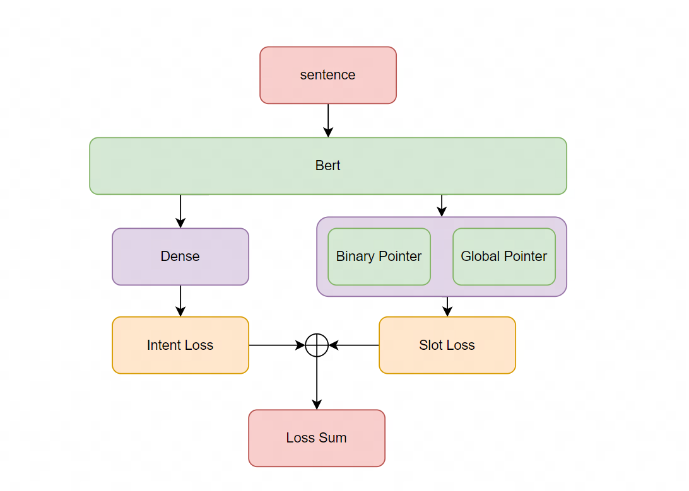
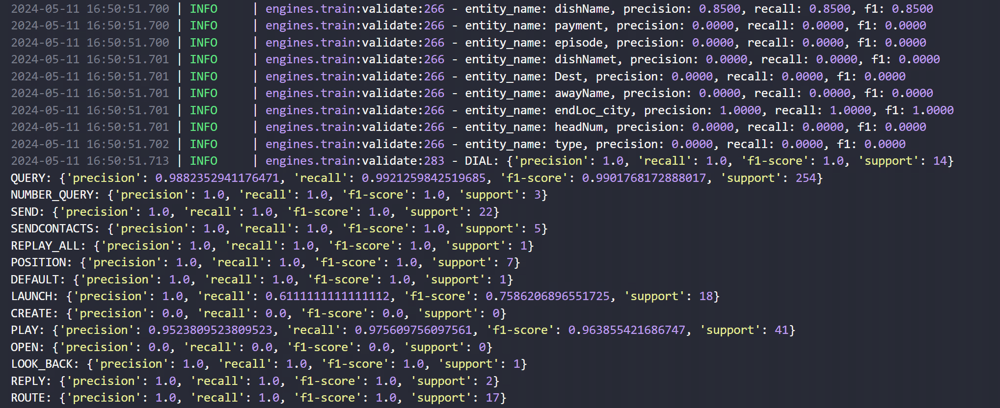
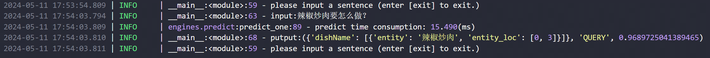

# NLU Pytorch

[](LICENSE)

[](requirements.txt)

## Introduction  
意图槽位模型训练框架（单意图、独立槽位），使用的是JointBERT的结构进行编写，槽位提取时可以选择双指针(Binary Pointer)实体抽取和Global Pointer两种方法，目前基座模型仅支持Bert，使用其他预训练模型需要自己修改并且加载。这个和另外一个项目[bert_nlu_joint](https://github.com/stanleylsx/bert_nlu_joint)不同的是，原来的这个bert_nlu_joint使用的tensorflow，并且槽位提取用的CRF，个人觉得本项目的实现方式更加优雅。

  

## Updates
日期| 版本     |描述
:---|:-------|---
2023-05-16| v1.0.0 |单意图槽位提取训练框架，支持bp和gp两种槽位抽取办法

## Requirement
几个重要环境：
* python：3.10+  
* torch：2.0.1+  
其它环境见requirements.txt  

## Mode  

项目提供了四种模式，如下： 

Mode               |       Detail              | 
:------------------|---------------------------|
train              | 训练NLU                   |
interactive_predict| 交互预测模式               |
test               | 跑测试集                   |
convert_onnx       | 将torch模型保存onnx文件    |
show_model_info    | 打印模型参数               |

## Getting start  
项目只需要在config.py中配置好所有策略，然后点击main.py即可运行，没有其他的入口。

### Train  
我在datasets下面准备了smp2019的测试数据集可以用来跑demo效果，如果是自己的数据集，需要自行准备和转换数据，config文件配置如下：
```
mode = 'train'

# 使用GPU设备
use_cuda = True
cuda_device = 0


configure = {
    # 训练数据集
    'train_file': 'datasets/smp_2019/train.json',
    # 验证数据集
    'dev_file': 'datasets/smp_2019/val.json',
    'validation_rate': 0.1,
    # 测试数据集
    'test_file': 'datasets/smp_2019/val.json',
    # 使用的预训练模型
    'ptm': 'hfl/chinese-bert-wwm-ext',
    # 抽取模型方式
    'slot_model': 'gp',
    # 预测加载方式
    'predict_engine': 'pytorch',
    # 模型保存的文件夹
    'checkpoints_dir': 'checkpoints/smp_2019'
}
```   
点击main.py即可运行训练，训练完后请修改checkpoints_dir路径为训练模型保存的路径，训练过程会打印意图和槽位的相关指标。  
  


### Interactive Predict  
config文件配置如下：   
```
mode = 'interactive_predict'

# 使用GPU设备
use_cuda = True
cuda_device = 0
```
运行main.py。  
  

### Others  
除了训练和交互预测外，还可以通过修改mode来跑测试集，或者进行onnx模型的转换给trtion server部署。

## Reference  
[《BERT for Joint Intent Classification and Slot Filling》](https://arxiv.org/abs/1902.10909)  
[Global Pointer](https://arxiv.org/abs/2208.03054)    
[bert_nlu_joint](https://github.com/stanleylsx/bert_nlu_joint)  

## License
该项目采用Apache 2.0 license开源许可证。  